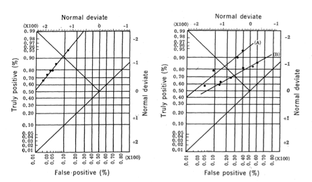
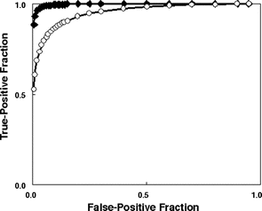
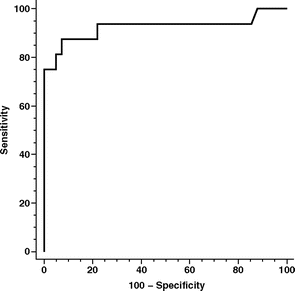
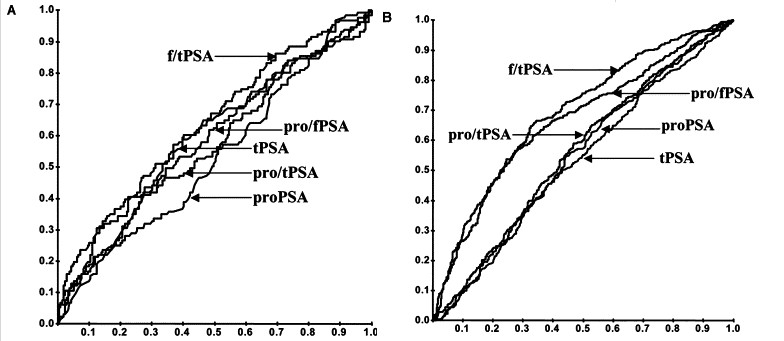
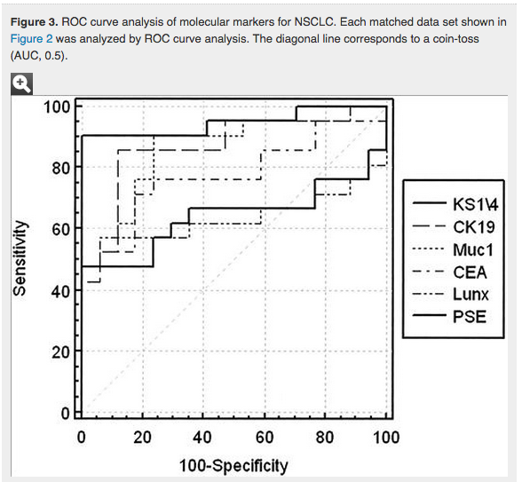
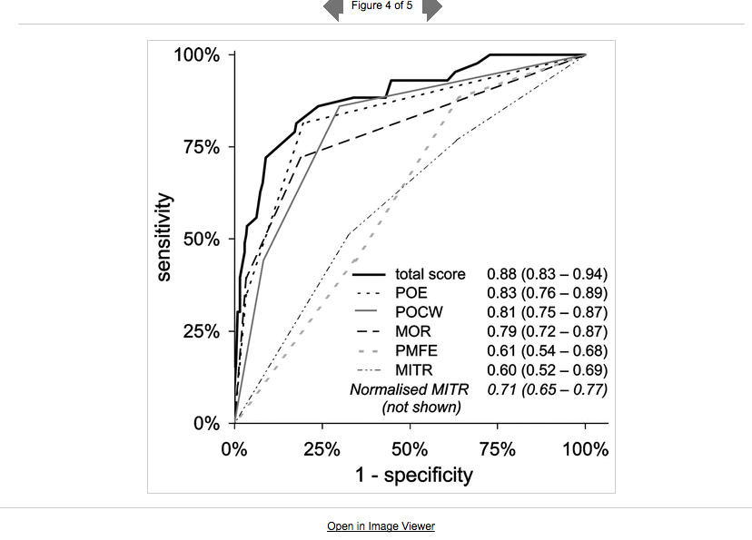
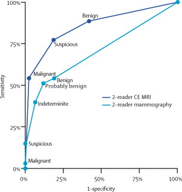
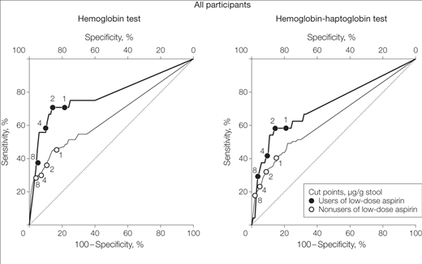
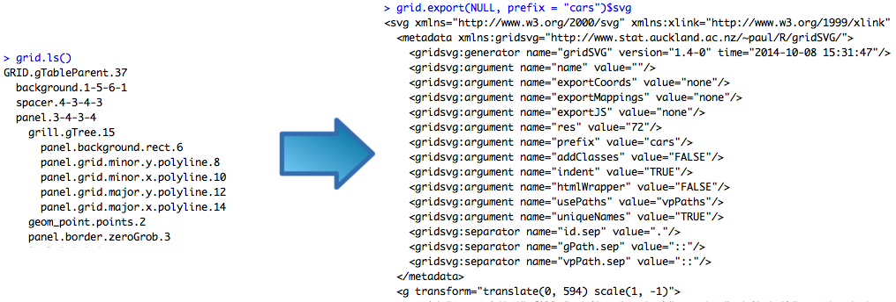
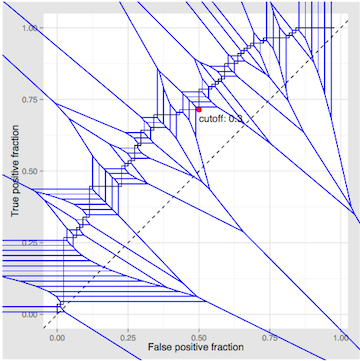

<style type="text/css">
blockquote {
  background: #f9f9f9;
  border-left: 10px solid #ccc;
  margin: 1.5em 10px;
  padding: 0.5em 10px;
  quotes: "\201C""\201D""\2018""\2019";
  font-size: 18px;
}
blockquote p {
  display: inline;
}
</style>

```{r init, include = FALSE}
library(ggplot2)
library(ggthemes)
library(knitr)

bltab <- function(x, name){
  
  t1 <- data.frame(as.list(table(x)))
  rownames(t1)[1] <- name
  kable(t1)
  
}

rocme <- function(M, D){
  
c <- sort(M)
TPF <- sapply(c, function(x) mean(M[D == 1] > x))
FPF <- sapply(c, function(x) mean(M[D == 0] > x))

data.frame(cbind(c, TPF, FPF))

}
```


# Introduction

## What is an ROC curve?

Binary biomarker and Binary outcome

<style>
td { border: 1px #aaa solid;
     padding: .2em; 
     }
</style>

<table align="center" style="text-align:center; border:1px; background:transparent; font-size: medium;">
<tr>
<td colspan="2" style="border:none;"></td>
<td colspan="2" style="background:#eeeebb;"><b>Condition<br />
(as determined by "Gold standard")</b></td>
</tr>
<tr>
<td style="border:none;"></td>
<td style="background:#ddddcc;">Total population</td>
<td style="background:#ffffcc;">Condition positive</td>
<td style="background:#ddddaa;">Condition negative</td>
<td style="background:#ddddcc;">Prevalence =<br />
Σ&#160;Condition positive
<div style="border-top:1px solid;">Σ&#160;Total population</div>
</td>
</tr>
<tr>
<td rowspan="2" style="background:#bbeeee;"><b>Test<br />
outcome</b></td>
<td style="background:#ccffff;">Test<br />
outcome<br />
positive</td>
<td style="background:#ccffcc;"><span style="color:#006600;"><b>True positive</b></span></td>
<td style="background:#eedddd;"><span style="color:#cc0000;"><b>False positive</b></span><br />
</td>
<td style="background:#ccffff;"> Positive predictive value (PPV) =<br />
Σ True positive
<div style="border-top:1px solid;">Σ&#160;Test&#160;outcome&#160;positive</div>
</td>
</tr>
<tr>
<td style="background:#aadddd;">Test<br />
outcome<br />
negative</td>
<td style="background:#eedddd;"><span style="color:#cc0000;"><b>False negative</b></span><br />
</td>
<td style="background:#bbeebb;"><span style="color:#006600;"><b>True negative</b></span></td>
<td style="background:#aadddd;">Negative predictive value (NPV) =<br />
Σ True negative
<div style="border-top:1px solid;">Σ&#160;Test&#160;outcome&#160;negative</div>
</td>
</tr>
<tr>
<td style="border:none;"></td>
<td style="border:none;"></td>
<td style="background:#ffffcc;">True positive fraction (TPF, Sensitivity) =<br />
Σ True positive
<div style="border-top:1px solid;">Σ&#160;Condition&#160;positive</div>
</td>
<td style="background:#ddddaa;">False positive fraction (FPF) =<br />
Σ False positive
<div style="border-top:1px solid;">Σ&#160;Condition&#160;negative</div>
</td>
<td style="background:#ddddcc;">Accuracy (ACC) =<br />
Σ&#160;True positive + Σ True negative
<div style="border-top:1px solid;">Σ&#160;Total population</div>
</td>
</tr>
<tr>
<td style="border:none;"></td>
<td style="border:none;"></td>
<td style="background:#ffffcc;">False negative fraction (FNF) =<br />
Σ False negative
<div style="border-top:1px solid;">Σ&#160;Condition&#160;positive</div>
</td>
<td style="background:#ddddaa;">True negative fraction</a> (TNF, Specificity) =<br />
Σ True negative
<div style="border-top:1px solid;">Σ&#160;Condition&#160;negative</div>
</td>
</tr>
<tr>
<td style="border:none;"></td>
</tr>
</table>

## Continuous test

 - *test positive* is defined as $M > c$
 - Consider measures as functions of $c$, i.e.
    $$ TPF(c) = Pr\{M > c | D = 1\} $$
    $$ FPF(c) = Pr\{M > c | D = 0\} $$
 - Plot $FPF(c)$ versus $TPF(c)$

## ROC Curve

```{r rocmin, fig.width = 5, fig.height = 5, echo = FALSE}
D <- rbinom(250, 1, .3)
M <- rnorm(250, mean = D, sd = .75)

tour <- rocme(M, D)
p1 <- ggplot(tour, aes(x = FPF, y = TPF)) + geom_path() + theme_classic() + 
  scale_x_continuous("False positive fraction at c") + scale_y_continuous("True positive fraction at c") 
p1
```

## Design considerations

**Grid lines**

```{r des1, echo = FALSE}
p2 <- p1 + theme_bw()
p2
```

## Design considerations

**Reference line**

```{r des2, echo = FALSE}
p2b <- p2 + geom_abline(intercept = 0, slope = 1, lty = 2)
p2b
```

## Design considerations

**Labels/Legend**

```{r des3, echo = FALSE, fig.width = 4.5}
y1 <- max(tour$TPF[tour$FPF <= .25]) - .1
p3 <- p2b + annotate("text", x = c(.25, .5), y  = c(y1, .4), label = c("Marker", "Reference"), angle = 45)
p3leg <- p2b + geom_line(data = NULL, aes(x = c(0, 0), y = c(0, 0), linetype = c("Marker", "Reference"))) + scale_linetype_discrete("Type")
p3
p3leg
```

## Design considerations

**Cutoff values**

```{r cut, echo = FALSE}
subdat <- tour[seq(1, nrow(tour), length.out = 15),]
p4 <- p3 + geom_point(data = subdat, aes(x = FPF, y = TPF)) + 
  geom_text(data = subdat, aes(x = FPF - .01, y = TPF + .01, label = round(c, 1), hjust = 1, vjust = 0))
p4
```

## Design considerations

**Other annotations**

```{r auc, echo = FALSE}
p4 + annotate("text", x = .75, y = .25, label = "AUC = 0.71 (0.62 to 0.80)")
```

## Goals

**Evaluate the state of ROC curve plots**

+ How are they used
+ What stories do they tell
+ What tools are there to create them
    
## A bit of history

A common academic rumor is that ROC curves were created during WWII to assess the ability of radar operators to distinguish flocks of birds from aircraft. 

I can't find any primary evidence of that.

  - ROC pioneers in signal detection: [Green and Swets, 1966](http://www.amazon.com/Signal-Detection-Theory-Psychophysics-Marvin/dp/0932146236), and [Egan 1975](http://books.google.com/books?id=V40oAAAAYAAJ&q=egan+roc+analysis+1975&dq=egan+roc+analysis+1975&hl=en&sa=X&ei=vE01VPvnDo-wyATwlYKYDg&ved=0CB0Q6AEwAA)
  - and radiology/medical decision making: [Lusted, 1978](http://www.sciencedirect.com/science/article/pii/S0001299878800154), [Swets and Pickett, 1982](http://www.amazon.com/Evaluation-Diagnostic-Systems-John-Swets/dp/0124122515)

## What were ROC curves used for?

> ROC curve describes possible relationships among the probabilities of the various types of correct and incorrect decisions. Therefore, it plays a central role in optimizing diagnostic strategies
- Lusted, 1971

> Conventional ROC curve describes the compromises that can be made between TPF and FPF as a decision threshold is varied. By appropriate choice of the decision threshold, a decision maker or observer can operate at (or near) any desired compromise that lies on the curve.
- Metz, 1978




# Literature review

## Methods

**Goal:** Assess the usage of the ROC plot in oncology studies

**Search criteria:** Clinical trials or observational studies in humans reported in major oncology journals for the past 10 years. 

**Query:** "ROC Curve" OR "ROC Analysis" OR "Receiver operating characteristic curve"

**Results:** 57 Papers, 47 figures extracted and reviewed

[Pubmed query](http://www.ncbi.nlm.nih.gov/pubmed/?term=Cancer%5BText+Word%5D+AND+(ROC+Curve%5BText+Word%5D+OR+ROC+analysis%5BText+Word%5D+OR+Receiver+operating+characteristic+curve%5BText+Word%5D)+AND+((Clinical+Trial%5Bptyp%5D+OR+Observational+Study%5Bptyp%5D)+AND+%22loattrfull+text%22%5Bsb%5D+AND+%222004%2F10%2F05%22%5BPDat%5D+%3A+%222014%2F10%2F02%22%5BPDat%5D+AND+%22humans%22%5BMeSH+Terms%5D+AND+jsubsetaim%5Btext%5D))

## Results

```{r fig1, echo = FALSE, fig.height = 3}
rev <- read.csv("../Literature Review/rocusage.csv", stringsAsFactors = FALSE)
rev <- subset(rev, flag != "comedy")

ggplot(rev, aes(x = factor(number.of.curves))) + geom_bar(fill = "blue", color = "black") + 
  theme_igray() + scale_x_discrete("Number of curves on plot")
```

```{r tab1, echo = FALSE, results = 'asis'}
bltab(rev$type, "Purpose")
```

## Results: axis labels

 - Sensitivity = <emph class="blue">True</emph> <emph class="red">positive</emph> fraction
 - 1 - Specificity = <emph class="blue">False</emph> <emph class="red">positive</emph> fraction
 - $Pr\{\color{red}{M > c} | \color{blue}{D = 1}\}$
 - $Pr\{\color{red}{M > c} | \color{blue}{D = 0}\}$
 
```{r jargon, echo = FALSE, results = 'asis'}
bltab(rev$axis.names, "Axis type")
```

## Results: other features

```{r features, echo = FALSE, results = 'asis'}
kable(rbind(
  "Diagonal Guide" = table(rev$guide),
  "Grid lines" = table(rev$minor.axes),
  "AUC given" = table(rev$auc)  ))

bltab(rev$cutoffs, "Cut points")
bltab(rev$labels, "Curve labels")
```

# Highlights and lowlights

## Extreme minimalist




## Spaghetti plots



## Spaghetti plots



## Tables in diguise



## Almost useful



## Getting there



# Analysis

## Pure comparison of tests

  - Value of a biomarker
    + AUC/Partial AUC?
    + Most north-western point = Total Gain, maximum Youden Index

### ROC plots encode this information poorly

```{r ex, fig.width = 5, fig.height = 3, echo = FALSE}
D <- rbinom(250, 1, .3)
M1 <- rnorm(250, mean = D, sd = .75)
M2 <- rnorm(250, mean = D, sd = 1.75)

tour2 <- rbind(rocme(M1, D), rocme(M2, D))
tour2$Marker <- c(rep("New great", 250), rep("Old bad", 250))

ggplot(tour2, aes(x = FPF, y = TPF, color = Marker)) + geom_path() + geom_abline(intercept = 0, slope = 1, lty = 2) + 
  theme_igray() + scale_color_colorblind() + 
  scale_x_continuous("False positive fraction at c") + scale_y_continuous("True positive fraction at c") 
```

## A more direct way

```{r line, fig.width = 7, fig.height = 3, echo = FALSE}
dlin <- data.frame(AUC = sort(runif(5)), marker = sort(sample(LETTERS, 5)))
ggplot(dlin, aes(y = AUC, x = marker)) + geom_point(size = 3) + 
  geom_segment(aes(y = pmax(AUC - .12, 0), yend = pmin(AUC + .12, 1), x = marker, xend = marker)) + 
  scale_y_continuous("AUC", limits = c(0, 1)) + theme_igray() + coord_flip()
```

See the works of [Tufte](http://www.edwardtufte.com/tufte/books_vdqi) and [Cleveland](http://dl.acm.org/citation.cfm?id=529269)


## What good is the ROC plot then?

Enable the observer to 

  - Accurately discern the operating charactersitics at any cutoff
  - Guide the choice of "optimal" cutoff
  - Determine what the cutoff is! 
  
  
# Tools for ROC plot creation  

## Currently available

#### Several R packages

  - [`ROCR`](http://rocr.bioinf.mpi-sb.mpg.de/) (Encodes cutoff values as color scale along curve)
  - [`pROC`](http://web.expasy.org/pROC/) (Basically standard R plot with CIs)
  - Others for specific estimation methods
  - Roll your own
  
#### Others

  - Excel!
  - SPSS
  - SAS?
  
Apparently these don't have sensible defaults

## My solution

```{r test-a, fig.keep='none', results = 'asis', echo = 1, fig.width=6, fig.height=6}
library(plotROC)
D.ex <- rbinom(100, 1, .5)
rocdata <- calculate_roc(rnorm(100, mean = D.ex), D.ex)
myrocplot <- ggroc(rocdata) + theme_igray()
cat(svgize_roc(myrocplot, cutoffs = rocdata$c, font.size = "12px", prefix = "a"))
```

## What it does

```{r example, eval = FALSE}
rocres <- calculate_roc(marker, outcome)
rocplot <- ggroc(rocres)

standalone_svg_roc(rocres) ## runs interactive plot in Rstudio or browser
svgize_roc(rocplot) ## generates code to include interactive plot in webpage or knitr
printize_roc(rocplot) ## generates roc plot suitable for print
```

## Print version

```{r, echo = FALSE, fig.width = 5, fig.height = 5}
printize_roc(myrocplot, rocdata)
```

# How it works

## `ggplot` + `gridSVG`

- `ggplot2` to construct an ROC curve chart with sensible defaults
    + Points at each cutoff are plotted invisibly
- `gridSVG` converts ggplot object to svg, and garnishes with data:
    



## `d3.js`

- Compute [Voronoi tesselation](http://en.wikipedia.org/wiki/Voronoi_diagram) over points that define ROC
- Bind hover events to polygons: display cutpoint and label
        



## Is anyone going to use it?

Maybe: [if we make it easy](http://brbweb1.nci.nih.gov:3838/plotROC/)


## How to contribute

http://github.com/sachsmc/plotROC

- Documentation, how tos
- Testing, bugs
- Features
- Criticism 
- Help write it up (JSS, R Journal, somewhere else?)

## Acknowledgements

**Giants**

- Hadley Wickham [`ggplot2`](http://ggplot2.org/)
- Mike Bostock [`d3.js`](http://d3js.org)
- Simon Potter [`gridSVG`](http://sjp.co.nz/projects/gridsvg/)

**For help with the review**

- Erin Gabriel 

**For help with the server**

- Yingdong Zhao

